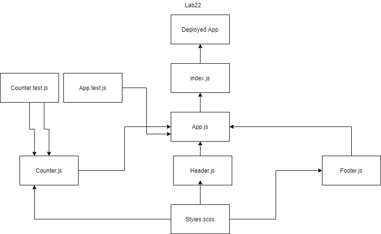

# Lab22-React Testing and Deployment

## React Testing and Deployment

### Author: Shubham Majumdar

### Links and Resources
* [Code Sandbox]()
* [Netlify](https://tender-swirles-0289f8.netlify.app)
* [aws](http://lab22.s3-website-us-west-1.amazonaws.com)
* [awsAmplify](https://master.d1o6p6dhb8y4zx.amplifyapp.com/)
* [Github Actions]

#### Documentation
* [api docs](http://xyz.com/api-docs) (API servers)
* JSDoc Comment Required for all modules and functions in all .js files

### Setup
#### `.env` requirements (where applicable)
* `PORT` -
* `MONGODB_URI` -

#### How to initialize/run your server app (where applicable)
* `npm start`
* npm install create-react-app
* create-react-app ./
* npm install node-sass
* npm install enzyme-adapter-react-16
  
#### Tests
* How do you run tests?
npm test

#### UML

